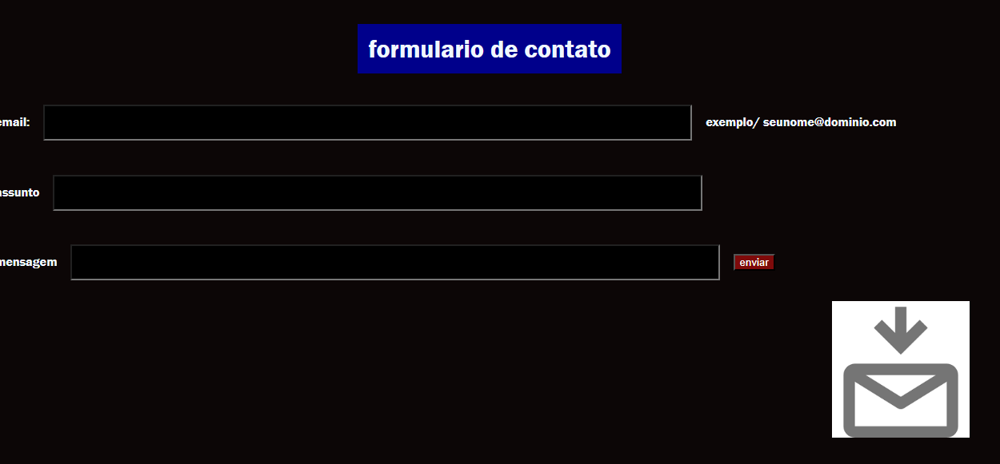

# form-contato

>

>representa o conteúdo de um documento HTML.

<h1 align = "center">

Elementos Utilizados

</h1>

* FORM: O elemento HTML <form> representa uma seção de documento que contém controles
interativos para enviar informações.
* LABEL: O elemento HTML <label> representa uma legenda para um item em uma interface
do usuário.
* INPUT: O elemento HTML <input> é usado para criar controles interativos para
formulários baseados na Web, a fim de aceitar dados do usuários; Uma grande variedade
de tipos de dados de entrada e Widgets de controle estão disponíveis, dependendo do dispositivo e do agente do usuário.
* SPAN: Ele deve ser usado somente quando nenhum outro elemento semântico é apropriado.É muito parecido com um elemento 
 mas 
 é um elemento de nível de bloco, enquanto a é um elemento de nível embutido.

 

# Button

* É um elemento interativo ativado por um usuário com mouse, teclado, dedo, comando de voz ou outra tecnologia assistiva. Uma vez ativado, ele executa uma ação, como enviar um formulário ou abrir uma caixa de diálogo.

>#  img 

* incorpora uma imagem no documento.

># Label

* Representa uma legenda para um item em uma interface do usuário.

># P

* Utilizado para parágrafo

># Body

* representa o conteúdo de um documento HTML.

># Input

* É usado para criar controles interativos para formulários baseados na Web, a fim de aceitar dados do usuário.

># h

>Determinar o tamanho da letra(string)
 
 # Autores
 
 * Leonardo-DEU INICIO DO PROJETO
 * Francisco-DONO DO PROJETO

# Tecnologias Utilizadas

>* ``HTML5``

>* ``CSS3``

>* ``Github``

>* ``Git``

>* ``Vscode``
 
# Fontes consultadas

* [Developer](https://developer.mozilla.org/en-US/docs/Web/HTML/Element/input)

 